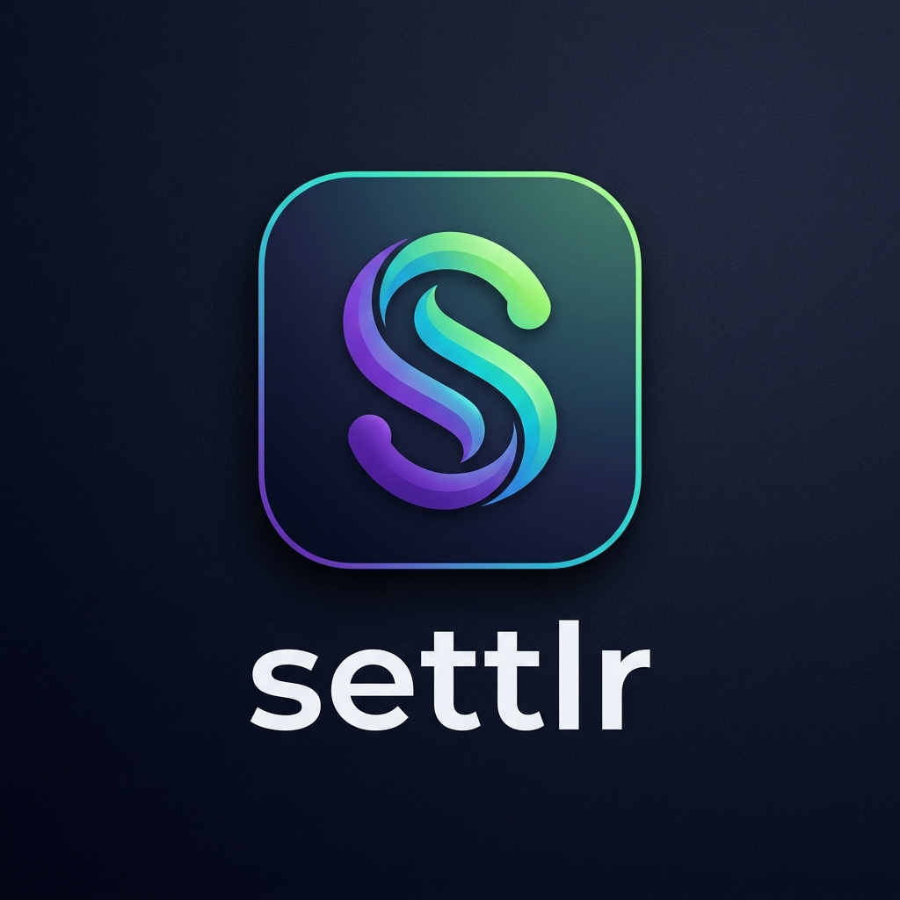

# Settlr 💸

Settlr is a secure, personal debt tracking Progressive Web Application (PWA) designed to help you manage who owes you and who you owe with ease and privacy.



## ✨ Key Features

- **🔐 Biometric Security**: Secure your financial data with Android Fingerprint, Face ID, or a backup PIN.
- **📱 PWA Ready**: Install Settlr as a standalone app on your Android or iOS home screen for an app-like experience.
- **⏳ Transaction History**: Keep track of every edit with detailed logs, including timestamps and reasons for changes.
- **📊 Financial Dashboard**: Get a clear overview of your Net Balance, total money owed to you, and total debt.
- **🇮🇳 Local Context**: Built-in support for INR (₹) and Indian date formats.
- **🌑 Premium Design**: Modern, glassmorphism-inspired dark mode UI built with Tailwind CSS v4.
- **📂 Local-First**: All your data is stored securely on your device using LocalStorage. No servers, no tracking.

## 🛠️ Tech Stack

- **Framework**: [React 18](https://reactjs.org/)
- **Language**: [TypeScript](https://www.typescriptlang.org/)
- **Styling**: [Tailwind CSS v4](https://tailwindcss.com/)
- **Build Tool**: [Vite](https://vitejs.dev/)
- **Icons**: [Lucide React](https://lucide.dev/)
- **Security**: [Web Authentication API (WebAuthn)](https://developer.mozilla.org/en-US/docs/Web/API/Web_Authentication_API)
- **Testing**: [Vitest](https://vitest.dev/) & [React Testing Library](https://testing-library.com/docs/react-testing-library/intro/)

## 🚀 Getting Started

### Prerequisites

- Node.js (v18 or higher)
- npm or yarn

### Installation

1. Clone the repository:
   ```bash
   git clone https://github.com/yourusername/settlr.git
   cd settlr
   ```

2. Install dependencies:
   ```bash
   npm install
   ```

3. Start the development server:
   ```bash
   npm run dev
   ```

4. Build for production:
   ```bash
   npm run build
   ```

## 🔒 Security Note

Web Authentication (Biometrics) requires a **Secure Context (HTTPS)**. 
- For local testing on mobile devices, use a secure tunnel like `ngrok` or Vite's `--https` flag.
- If HTTPS is not detected, the app will automatically fall back to PIN-based authentication.

## 🧪 Testing

Run the test suite using Vitest:
```bash
npm run test
```

## 📄 License

This project is licensed under the MIT License.
